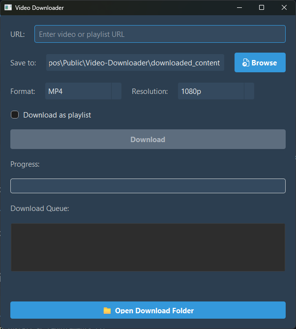

<!-- README.md -->
# Video Downloader



[](https://www.python.org/)
[](LICENSE)

A simple yet powerful video downloader with a graphical user interface built using Python and PyQt5. This tool allows you to download videos and playlists from hundreds of websites.

---

## Screenshots

### Main Window


### Download in Progress


### Error Handling


---

## Features

- **Easy-to-Use GUI**: A clean and simple interface for downloading videos.
- **Multiple Site Support**: Powered by `yt-dlp`, it supports a vast number of video hosting sites.
- **Format Selection**: Download videos as `MP4` or extract audio as `MP3`.
- **Resolution Options**: Choose your preferred video quality (1080p, 720p, etc.).
- **Playlist Downloads**: Download an entire playlist with a single click.
- **Custom Save Location**: Choose where you want to save your downloaded files.
- **Real-time Progress**: A progress bar keeps you updated on the download status.

## Setup and Usage

Follow these steps to get the application running on your local machine.

### 1. Prerequisites

- **Python 3**: Make sure you have Python 3 installed.
- **ffmpeg**: This is required for converting video and audio files (especially for creating MP3s). You can download it from [ffmpeg.org](https://ffmpeg.org/download.html) and ensure it's in your system's PATH.

### 2. Installation

Clone the repository and install the required Python packages:

```bash
# Clone the repository (or download the source)
git clone <your-repo-url>
cd <repository-folder>

# Install dependencies
pip install -r requirements.txt
```

### 3. Running the Application

To launch the GUI, run the following command from the project's root directory:

```bash
python main.py
```

## How to Use

1.  Launch the application using the command above.
2.  Paste the video or playlist URL into the URL input field.
3.  Choose your desired download location using the "Browse" button.
4.  Select the format (MP4/MP3) and resolution.
5.  Check the "Download as playlist" box if the URL is a playlist.
6.  Click the "Download" button and wait for the process to complete.
